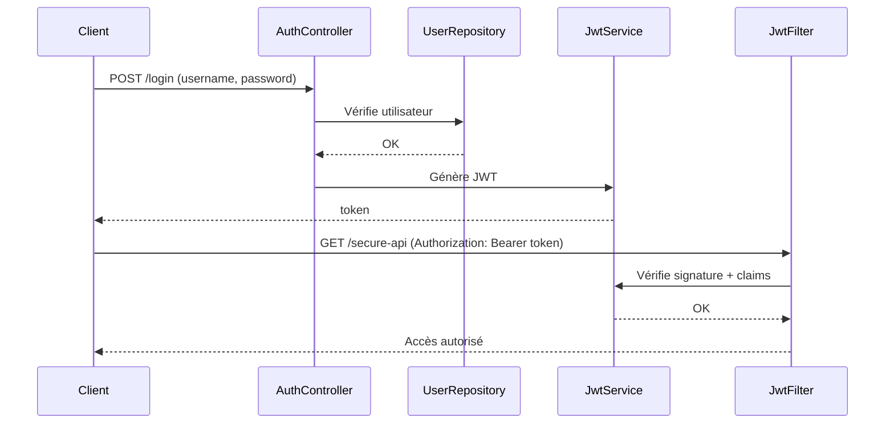

# Auth Service – TAF actuel

Le module **`auth`** est le service d’authentification et d’autorisation de la plateforme TAF.  
Il gère la **connexion**, l’**inscription**, la **génération et validation des tokens JWT**, 
ainsi que l’intégration avec **Spring Security** et **MongoDB**.

---

## Fonctionnalités principales
- **Inscription (`/signup`)** : création d’un nouvel utilisateur.
- **Connexion (`/login`)** : vérification des identifiants + génération d’un **JWT**.
- **Token Refresh (`/refresh`)** : renouvellement automatique des jetons.
- **Validation (`/validate`)** : vérifie la validité et les claims d’un JWT.
- **Sécurité API** : Spring Security + filtres JWT.
- **Gestion des rôles** : `User`, `Admin`, etc. stockés dans MongoDB.

---

## Structure du module
```text
auth/
 ├── AuthGatewayApplication.java        # Point d’entrée Spring Boot
 ├── config/SecurityConfig.java         # Configuration Spring Security
 ├── controller/AuthController.java     # Endpoints login/signup/refresh
 ├── entity/User.java                   # Entité utilisateur
 ├── entity/Role.java, ERole.java       # Gestion des rôles
 ├── jwt/                               # Gestion des JWT
 │    ├── JwtAuthenticationFilter.java
 │    └── JwtUtil.java
 ├── repository/UserRepository.java     # Accès MongoDB utilisateurs
 ├── repository/RoleRepository.java     # Accès MongoDB rôles
 ├── services/CustomUserDetailsService.java
 ├── services/JwtService.java
 └── payload/                           # Objets de requête et réponse
```

---


## 🛠️ Technologies
- Spring Boot **3.3.x**
- Spring Security
- Spring Data MongoDB
- JWT (`jjwt 0.11.5`)
- Lombok
- Swagger (springdoc-openapi)
- Rest-Assured (tests)

---

## Commandes (à lancer depuis `auth/`)

### Compiler le projet
```bash
./gradlew build
```

### Nettoyer et reconstruire
```bash
./gradlew clean build
```

### Exécuter les tests
```bash
./gradlew test
```

---

## Exemple de flux JWT




